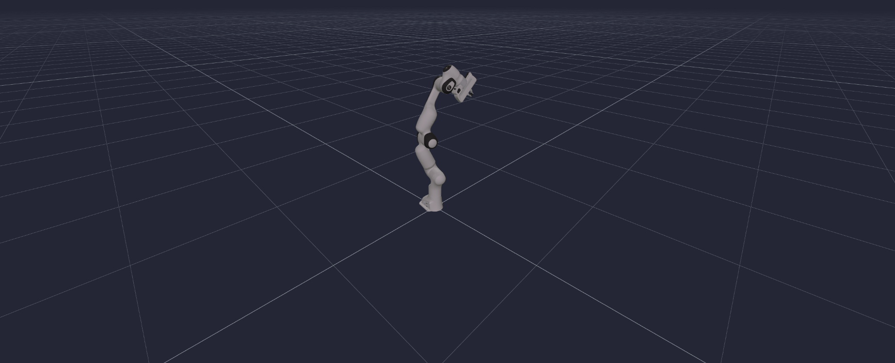

<p align="center">
  <a href="https://www.openroboticmetaverse.org">
    
  </a>
</p>
<h1 align="center">
  🤖 Open Robotic Metaverse MVP - Robotics Platform 🌐
</h1>


Yet another Vue 3 app ... 👾

## Overview 🔍

This project serves as the MVP (Minimum Viable Product) 🚀 for a larger vision aimed at developing a robotic metaverse. Utilizing a combination of modern web technologies, this platform allows users to interact with robots through a web browser, fostering a unique and interactive environment.



## Key Features 🗝️

- **Interactive Robotic Control**: Users can directly interact with robots in a virtual space. 🕹️
- **Real-Time Observation**: Enables witnessing interactions between other users and robots. 👀
- **Cross-User Engagement**: Supports multiple users interacting simultaneously within the metaverse. 👥

## Technology Stack 🛠️

- **Frontend**: Developed using Vue 3 and Vite, offering a responsive and efficient user interface. 🌟
- **Backend**: Powered by Node.js, ensuring robust server-side operations and data management. 💪


## Setup ⚙️

1. Clone the Repo 📥

```bash
git clone https://github.com/openroboticmetaverse/mvp-webapp.git

```
```bash
cd mvp-webapp
```

2. Docker Compose 🐳

```bash
docker compose up -d
```

## Start the backend server 💻

Open a console in the container 🖥️
```bash
docker exec -it mvp_backend /bin/bash
```

In the container console:
```bash
npm i
```
```bash
npm run start
```
## Start the frontend 🖼️

(In a new terminal)

Open a console in the container 🖥️
```bash
docker exec -it mvp_frontend /bin/bash
```
In the container console:
```bash
npm i
```
```bash
npm run dev
```


Enjoy 🎉🥳
